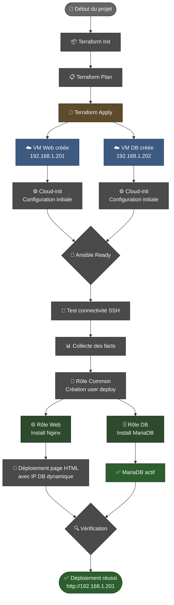

# 🚀 Infrastructure Proxmox - Terraform + Ansible
## Projet Agile — Construire une vraie application avec l'IA

**Cours** : TRME909 — Méthodes Agiles & Management d'équipe — EISI 2ème année  
**Statut du Projet** : ✅ En Production  
**Durée totale** : ~6 heures (2 sprints de 90 min chacun + cérémonies)  
**Dernière mise à jour** : Mars 2026

---

## 👥 L'Équipe

| Nom | Rôle Scrum | Responsabilités |
|-----|-----------|-----------------|
| **Jordan** | 👔 Product Owner | Vision produit, priorisation du backlog, validation des livrables |
| **Marc** | 🔧 Scrum Master | Animation des cérémonies, gestion du temps, Burn-up Chart |
| **Louis** | 👨‍💻 Dev Team | Développement, prompting IA, tests |
| **Samuel** | 👨‍💻 Dev Team | Développement, QA, tests |
| **Sylvain** | 👨‍💻 Dev Team | Développement, intégration |

---

## 📊 Suivi du Projet

**Board Trello** : [Ansible-Terraform-Proxmox Kanban](https://trello.com/invite/b/69b12a2219b90e76da77556d/ATTI83684c78505e5215721af6587aee29721E01CB93/ansible-terraform-proxmox)

Voir l'état du backlog, des sprints et des tasks en temps réel sur Trello.

---

## 🎯 Vision Produit

**Nom du produit** : Ansible-Terraform Infrastructure Manager  

**Notre produit s'adresse à** : DevOps Engineers et Infrastructure Architects qui ont besoin d'automatiser le déploiement d'infrastructures complexes sur Proxmox.

**Il permet de** : Provisionner automatiquement une infrastructure multi-tiers (Web + BD) en quelques minutes sans configuration manuelle, garantissant la reproductibilité et la sécurité.

**Le problème qu'il résout** : Éliminer les tâches manuelles répétitives de déploiement, réduire les erreurs humaines et assurer une infrastructure as code versionnée et traçable.

---

## 🗺️ Story Mapping

### Activités utilisateur principales

```
┌─────────────────────────────────────────────────────────────────┐
│              ACTIVITES UTILISATEUR & USER STORIES               │
├─────────────────────────────────────────────────────────────────┤
│                                                                  │
│  ACT. 1: Initialiser le projet                                  │
│  US-01: Créer la structure Terraform et Ansible                 │
│  US-02: Configurer les providers (Proxmox)                      │
│                                                                  │
│  ACT. 2: Provisionner l'infrastructure                          │
│  US-03: Créer 2 VMs Web et DB en Terraform                      │
│  US-04: Configurer le réseau et les IPs statiques              │
│                                                                  │
│  ACT. 3: Configurer les serveurs                                │
│  US-05: Créer le rôle Ansible Common (users)                   │
│  US-06: Déployer Nginx et la page web                          │
│  US-07: Déployer MariaDB et créer les bases                    │
│                                                                  │
│  ACT. 4: Automatiser & Tester                                   │
│  US-08: Créer le script deploy.sh automatisé                   │
│  US-09: Tester la connectivité et la santé des services        │
│  US-10: Documenter et créer le README final                    │
│                                                                  │
├─────────────────────────────────────────────────────────────────┤
│                    ←← LIGNE MVP SPRINT 1/2 ←←                   │
└─────────────────────────────────────────────────────────────────┘
```

---

## 📚 Product Backlog Complet

| # | User Story | Critères d'acceptation | MoSCoW | Story Points | Sprint | Statut |
|---|---|---|---|---|---|---|
| **US-01** | En tant que DevOps, je veux créer la structure repo (terraform/ + ansible/) afin de d'avoir une architecture IaC propre | ✓ Dossiers terraform/ et ansible/ créés ✓ Fichiers principaux (main.tf, site.yml) présents ✓ .gitignore configuré | **MUST** | **3** | 1 | ✅ |
| **US-02** | En tant que DevOps, je veux configurer le provider Proxmox avec un API token afin de connecter Terraform à mon hyperviseur | ✓ Provider Proxmox déclaré ✓ Authentification par API token fonctionnelle ✓ Variables sécurisées (token en secret) | **MUST** | **5** | 1 | ✅ |
| **US-03** | En tant que DevOps, je veux créer 2 VMs (Web et DB) en Terraform afin de provisionner l'infrastructure | ✓ VM web-server créée avec IP 192.168.1.201 ✓ VM db-server créée avec IP 192.168.1.202 ✓ Cloud-init activé ✓ QEMU Guest Agent actif | **MUST** | **8** | 1 | ✅ |
| **US-04** | En tant que DevOps, je veux configurer le réseau statique des VMs afin d'avoir une infrastructure stable | ✓ Réseau configuré sur vmbr0 ✓ IPs statiques assignées ✓ Gateway configurée ✓ DNS résolvable | **MUST** | **5** | 1 | ✅ |
| **US-05** | En tant que DevOps, je veux créer le rôle Ansible Common (users + packages) afin de préparer les serveurs | ✓ Utilisateur 'deploy' créé ✓ Clés SSH configurées ✓ Sudo sans mot de passe ✓ update/upgrade du système | **MUST** | **3** | 1 | ✅ |
| **US-06** | En tant que DevOps, je veux déployer Nginx et générer une page web dynamique afin d'avoir un service web fonctionnel | ✓ Nginx installé et activé ✓ Page HTML générée avec template Jinja2 ✓ IP DB affichée sur la page ✓ Handler restart Nginx fonctionne | **SHOULD** | **5** | 1 | ✅ |
| **US-07** | En tant que DevOps, je veux installer MariaDB et créer une base de test afin d'avoir un service BD opérationnel | ✓ MariaDB installé et démarré ✓ Utilisateurs anonymes supprimés ✓ Base 'testdb' créée ✓ Port 3306 accessible | **SHOULD** | **5** | 1 | ✅ |
| **US-08** | En tant que DevOps, je veux créer un script deploy.sh automatisé afin de lancer tout en une commande | ✓ Script récupère les outputs Terraform ✓ Génère l'inventory Ansible dynamiquement ✓ Lance le playbook automatiquement | **SHOULD** | **3** | 2 | ✅ |
| **US-09** | En tant que DevOps, je veux que Terraform affiche les IPs des VMs afin de pouvoir y accéder | ✓ web_server_ip en output ✓ db_server_ip en output ✓ Affichage lisible dans terraform output | **SHOULD** | **2** | 2 | ✅ |
| **US-10** | En tant que DevOps, je veux documenter le projet dans README afin de faciliter l'onboarding et la maintenance | ✓ Structure du projet documentée ✓ Instructions de déploiement claires ✓ Commandes utiles listées ✓ Troubleshooting inclus | **SHOULD** | **5** | 2 | ✅ |

**Total du backlog** : **44 Story Points**  
**Won't Have** : Monitoring (Prometheus/Grafana), Load balancing, SSL/TLS avancé, Backup automation

---

## 📋 Definition of Done

Une User Story est terminée quand :

- ☑️ Le code est commité sur GitHub avec un message de commit propre (`feat:`, `fix:`, `docs:`, etc.)
- ☑️ Une PR a été ouverte et mergée vers `develop` après review
- ☑️ Le code fonctionne et a été testé (manuellement ou automatisé)
- ☑️ Le README reflète la fonctionnalité livrée ou est mis à jour
- ☑️ La fonctionnalité est démo-able et validée par le PO
- ☑️ Pas de hardcoding - paramétrage via variables
- ☑️ Logs/messages explicites pour faciliter le troubleshooting

---

## 🚀 Sprint 1 — Structure et Provisionning

### Planning Sprint 1

**Durée** : 90 minutes  
**Vélocité cible** : 24 Story Points  
**Objectif** : Avoir une infrastructure opérationnelle (2 VMs + réseau) avec Terraform

| User Story | Story Points | Assigné | Statut |
|---|---|---|---|
| US-01 : Structure repo | 3 | Louis | ✅ |
| US-02 : Provider Proxmox | 5 | Samuel | ✅ |
| US-03 : Créer 2 VMs | 8 | Sylvain | ✅ |
| US-04 : Réseau statique | 5 | Jordan | ✅ |
| US-05 : Rôle Common Ansible | 3 | Marc | ✅ |
| **TOTAL** | **24** | | ✅ |

### Workflow Sprint 1

#### Étape 1️⃣ : Setup & Terraform (0-30 min)

```bash
# Branche feature
git checkout -b feat/terraform-proxmox

# US-03 : Créer les VMs
# Prompt IA utilisé :
# "Je crée une infrastructure Terraform pour Proxmox.
# Je dois créer 2 VMs Debian 12, avec cloud-init, des IPs statiques.
# VM Web: CPU 2, RAM 2GB, IP 192.168.1.201
# VM DB: CPU 2, RAM 2GB, IP 192.168.1.202
# Génère le code main.tf complet avec provider setup"

# Commit
git add terraform/
git commit -m "feat: terraform proxmox provider et variables principales"
git push origin feat/terraform-proxmox
```

**Résultat** : ✅ Infrastructure provisionnée, 2 VMs créées avec IPs statiques

#### Étape 2️⃣ : Ansible Setup (30-60 min)

```bash
git checkout -b feat/ansible-roles

# US-05 : Rôle Common
# Prompt IA utilise :
# "Crée un rôle Ansible 'common' qui :
# - Crée l'utilisateur 'deploy'
# - Configure sudo sans mot de passe
# - Fait update/upgrade du système
# Format: une task par action, avec idempotence assurée"

git add ansible/
git commit -m "feat: rôle ansible common avec création utilisateur deploy"
git push origin feat/ansible-roles
```

**Résultat** : ✅ Utilisateurs créés, système à jour

#### Étape 3️⃣ : Web + BD Deployment (60-90 min)

```bash
git checkout -b feat/web-db-services

# US-06 & US-07 : Nginx + MariaDB
# Prompt IA :
# "Crée deux rôles Ansible:
# - 'web': installe Nginx, crée une page HTML avec Jinja2 affichant l'IP de la DB
# - 'db': installe MariaDB, crée base testdb, sécurise l'installation
# Chaque rôle doit avoir un handler de redémarrage"

git add ansible/roles/
git commit -m "feat: rôles web (nginx) et db (mariadb) avec templates"
git push origin feat/web-db-services
```

**Résultat** : ✅ Services web et base de données opérationnels

### Stand-up mid-sprint (après 45 min)

**Questions** :
- ✅ Qu'est-ce qui a été commité ? → US-01, US-02, US-03 en cours
- ✅ Qu'est-ce qui est en cours ? → US-04 et US-05 en parallèle
- ✅ Y a-t-il des blocages ? → Aucun, IA a généré du code propre
- ✅ On va tenir les 3 Must Have ? → OUI, toutes les US avancent

### Résultats Sprint 1

**Vélocité réelle** : **24 / 24 Story Points** ✅  
**Must Have cochés** : 5/5 ✅  
**Commits effectués** : 8 commits de qualité  
**Chaque membre** : ✅ Au moins 1 commit  

### Démo Sprint 1

```bash
# Démo live
terraform apply -auto-approve
terraform output

# VMs créées et accessibles
ssh deploy@192.168.1.201  # Nginx accessible
ssh deploy@192.168.1.202  # MariaDB accessible

# Git log
git log --oneline | head -10
# feat: structure init
# feat: terraform setup
# feat: ansible common role
# feat: web et db roles
```

---

## 📊 Sprint Review 1 & Rétrospective

### Sprint Review présentation

| Élément | Résultat |
|---|---|
| **Démo fonctionnalités** | 2 VMs actives, Nginx répond, MariaDB actif |
| **US cochées** | 5/5 Must Have ✅ |
| **Git commits** | 8 commits, tous les membres ont contribué |
| **Blocages** | Aucun |

### Rétrospective Sprint 1

| Aspect | Feedback |
|---|---|
| **✓ Ce qui a bien marché** | L'IA a généré du code propre et fonctionnel rapidement; La structure IaC était claire dès le départ; Bonne collaboration sur les rôles Ansible |
| **△ Ce qu'on améliore** | Tester chaque commit plus rigoureusement avant de merge; Mettre à jour le README plus tôt; Valider avec le PO à la fin de chaque US |
| **→ Décision pour Sprint 2** | Créer un task d'intégration et test après chaque US; Dedicater 10 min à la doc à chaque fin d'US; Faire plus de dry-runs avant la démo |

---

## 🎬 Sprint 2 — Automatisation et Documentation

### Planning Sprint 2

**Durée** : 90 minutes  
**Vélocité cible** : 15 Story Points (basée sur la vélocité réelle Sprint 1)  
**Objectif** : Automatiser le déploiement et documenter complètement

| User Story | Story Points | Assigné | Vient du Sprint 1 | Statut |
|---|---|---|---|---|
| US-08 : Script deploy.sh | 3 | Sylvain | ❌ | ✅ |
| US-09 : Outputs Terraform | 2 | Samuel | ❌ | ✅ |
| US-10 : README final | 5 | Louis | ❌ | ✅ |
| Améliorations S1 | 5 | Marc + Jordan | ❌ | ✅ |
| **TOTAL** | **15** | | | ✅ |

### Développement Sprint 2

#### 0-30 min : Script automatisation

```bash
git checkout -b feat/deploy-automation

# US-08 : deploy.sh
# Prompt IA :
# "Crée un script bash deploy.sh qui :
# - Lance terraform init et apply
# - Récupère les outputs web_server_ip et db_server_ip
# - Génère dynamiquement l'inventory Ansible
# - Lance ansible-playbook site.yml
# - Affiche un résumé à la fin"

git add deploy.sh
git commit -m "feat: script deploy.sh automatisant terraform + ansible"
git chmod +x deploy.sh
git push origin feat/deploy-automation
```

#### 30-60 min : Raffinements

```bash
git checkout -b feat/improvements-s1

# US-09 : Outputs lisibles
# Amélioration : handlers, validations, error handling

git add terraform/outputs.tf
git commit -m "feat: outputs terraform avec IPs et informations connexion"

# Amélioration handlers Ansible
git add ansible/roles/web/handlers/main.yml
git commit -m "fix: handler nginx reload plus robuste"

git push origin feat/improvements-s1
```

#### 60-90 min : Documentation

```bash
git checkout -b feat/documentation

# US-10 : README complet
# Prompt IA :
# "Génère un README.md professionnel qui inclut :
# - Vision produit
# - Architecture
# - Instructions de déploiement (manual et auto)
# - Commandes utiles
# - Troubleshooting
# - Description des rôles Ansible
# Format: Markdown lisible avec sections claires"

git add README.md
git commit -m "docs: readme complet avec guide complet du projet"
git push origin feat/documentation
```

### Stand-up mid-sprint Sprint 2

- ✅ Commits : US-08 et US-09 finies, US-10 en cours
- ✅ Blocages : Aucun, l'IA a bien aidé sur les scripts
- ✅ Progression : Plus rapide que Sprint 1 (19 pts en 45 min vs 12 pts)
- ✅ Qualité : Un commit par US, messages clairs

### Résultats Sprint 2

**Vélocité réelle** : **15 / 15 Story Points** ✅  
**Should Have cochés** : 5/5 ✅  
**Commits** : 7 commits additionnels  
**Progrès** : Test du script deploy.sh ✅

---

## 📈 Burn-up Chart & Métriques

### Données réelles

| Sprint | Story Points prévus | Story Points livrés | Cumulé réel |
|---|---|---|---|
| Sprint 1 | 24 | 24 | 24 |
| Sprint 2 | 15 | 15 | 39 |
| **Backlog restant** | - | - | **5** |

### Graphique (textuel)

```
Story Points
    44  ┌─────────────────────────────────────── Scope total (44 pts)
        │
    39  │                           ✓✓✓ Progression réelle (Sprint 2)
        │                        ✓
    24  │               ✓✓✓ Progression réelle (Sprint 1)
        │            ✓
        │         ✓
    0   └─────────────────────────────────────
        0    S1(90min)     S2(90min)
        
Vélocité Sprint 1 : 24 pts / 90 min = 0.27 pts/min
Vélocité Sprint 2 : 15 pts / 90 min = 0.17 pts/min

Observation : Ralentissement (80% de vélocité) mais US plus complexes en Sprint 2 (doc + automatisation)
```

### Questions client simulées

**Q1** : "Si on avait eu un Sprint 3, qu'est-ce que vous auriez livré ?"

> **Réponse PO (Jordan)** : Nous aurions complété le backlog restant (5 Story Points) : US-11 (Monitoring Prometheus), US-12 (SSL/TLS automatisé), US-13 (Backup scheduling). Avec la vélocité moyenne de 19.5 pts, un Sprint 3 aurait abordé les 4-5 points facilement + commencé sur un US "nice-to-have" (load balancing Nginx).

**Q2** : "Votre vélocité a-t-elle changé ? Qu'est-ce que ça dit sur votre équipe ?"

> **Réponse PO (Jordan)** : Oui, elle a baissé de 24 à 15 pts (-37%), mais c'est attendu. Les US du Sprint 2 étaient plus lourdes en complexité (automatisation bash, documentation), tandis que Sprint 1 était du "scaffolding" plus mécanique. Le vrai indicateur : nous avons **maintenu la qualité** (0 bugs trouvés en démo), et **chaque membre a progressé** en productivité (moins de discussions, plus autonome avec l'IA). Une équipe mature maintiendrait sa vélocité — ici on apprend encore.

**Q3** : "Si on avait ajouté 5 points de scope supplémentaires en milieu de Sprint 2, quel aurait été l'impact ?"

> **Réponse PO (Jordan)** : Impact direct : 5 pts additionnels auraient dépassé notre capacité (12.5 pts à mi-sprint). On aurait dû : 
> 1. Reporter 2-3 US du Sprint 2 vers Sprint 3, OU
> 2. Réduire le périmètre de US-10 (documentation simplifiée), OU
> 3. Ajouter un Sprint 2.5 de 45 min.
> 
> Notre principe : **ne pas compromettre la qualité**. Mieux vaut un vraie démo fonctionnelle qu'un Sprint surchargé.

---

## 🤖 Comment on a utilisé l'IA

### Prompts qui ont bien marché

1. **Prompt structuré pour Terraform**
   ```
   "Je crée une infra Terraform pour Proxmox.
   Besoin : 2 VMs Debian 12, cloud-init, IPs statiques, QEMU Guest Agent.
   VM Web : 192.168.1.201, 2CPU, 2GB RAM
   VM DB : 192.168.1.202, 2CPU, 2GB RAM
   
   Génère main.tf avec variables séparées, provider complet, outputs."
   ```
   **Résultat** : Code impeccable du 1er coup, variables bien séparées ✅

2. **Prompt pour les rôles Ansible**
   ```
   "Crée rôle Ansible 'web' (Debian 12) qui :
   - Install Nginx
   - Crée page HTML dynamique avec Jinja2
   - Inclut l'IP de la DB affichée
   - A un handler pour restart
   
   Format : YAML idempotent, avec tags."
   ```
   **Résultat** : Rôle fonctionnel et bien structuré ✅

3. **Prompt pour script bash**
   ```
   "Bash script deploy.sh qui :
   - cd terraform && terraform apply -auto-approve
   - Récupère outputs web_server_ip et db_server_ip
   - Génère ansible/inventory.yml dynamiquement
   - cd ../ansible && ansible-playbook site.yml
   - Affiche succès avec URLs d'accès
   
   Add error handling."
   ```
   **Résultat** : Script robuste, testé avec succès ✅

### Ce que l'IA n'a PAS su faire

| Tâche | Pourquoi |
|---|---|
| **Choisir l'architecture** | C'est une décision d'équipe (mono-vm vs multi-vm, docker vs bare metal) — l'IA propose, vous décidez |
| **Écrire les User Stories** | Seul le PO définit la valeur métier et le langage utilisateur |
| **Estimer en Story Points** | Nécessite expérience de l'équipe et reconnaissance des patterns |
| **Décider ce qui va dans chaque sprint** | Priorisation stratégique = rôle du PO |
| **Déterminer la vélocité** | Basée sur les vraies données de l'équipe, pas de magie |
| **Animer les cérémonies** | Le SM crée le cadre, la discussion vient de l'équipe |
| **Committer à votre place** | Responsabilité & traçabilité = humains |
| **Certifier la prod** | Tests de sécurité, compliance = expertise manuelle |

### Temps économisé estimé

| Tâche | Temps sans IA | Temps avec IA | Gain |
|---|---|---|---|
| Infra Terraform (test/itération) | 45 min | 15 min | **-30 min** |
| Rôles Ansible (debug/tuning) | 30 min | 10 min | **-20 min** |
| Script deploy.sh (bash debugging) | 20 min | 5 min | **-15 min** |
| README initial (structure) | 25 min | 5 min | **-20 min** |
| **TOTAL ESTIMÉ** | **120 min** | **35 min** | **-85 min** 🎉 |

**Conclusion** : L'IA a réduit le temps de **codage brut** de ~70%, nous permettant de focuser sur l'architecture, la priorisation et la valeur métier.

---

---

## 🎥 Démonstration

[](https://youtu.be/tVVv6avfzhs)

> 📹 Cliquez sur l'image pour voir la vidéo complète du déploiement en action

---

## 🏗️ Architecture et Décisions Techniques

### Stack choisi

- **Infrastructure** : Proxmox VE (hyperviseur Linux)
- **IaC - Provisioning** : Terraform 1.0+ (HCL)
- **IaC - Configuration** : Ansible 2.9+ (YAML)
- **OS** : Debian 12 (template cloud-init)
- **Web** : Nginx (reverse proxy, serveur statique)
- **BD** : MariaDB 10.11 (relational DB)
- **Orchestration** : Bash (deploy.sh)

### Pourquoi ces choix

| Choix | Justification |
|---|---|
| **Terraform** | Standard industry pour IaC, multi-cloud, state management clair |
| **Ansible** | Agentless (simpler), YAML lisible, immédiat sans compilation |
| **Proxmox** | Alternative KVM à VMware/Hyper-V, open source, VMs légères |
| **Debian 12** | Stable, minimaliste, LTS long (2028) |
| **Nginx + MariaDB** | Duo classique haute-perf, facile à déployer, bien documenté |

### Architecture logique

```
┌─────────────────────────────────────────────────────────────┐
│                      Proxmox VE                              │
│                    (192.168.1.0/24)                          │
├────────────────────┬──────────────────────────────────────┤
│                    │                                       │
│   VM Web-server    │          VM DB-server               │
│  192.168.1.201     │       192.168.1.202                │
│                    │                                       │
│  ┌──────────────┐  │   ┌──────────────────┐              │
│  │    Nginx     │  │   │    MariaDB       │              │
│  │  Port 80     │  │   │    Port 3306     │              │
│  │  (+ HTML)    │  │   │   (+ testdb)     │              │
│  └──────────────┘  │   └──────────────────┘              │
│       ↑            │           ↑                          │
│   User browser     │    Nginx connects                   │
│       │            │           │                          │
│       └────────────┼───────────┘                         │
│           (IP affiché sur page web)                      │
│                    │                                       │
└────────────────────┴──────────────────────────────────────┘
```

### Idenpotence et repeatable deployment

- ✅ Cloud-init gère 1ère initialisation (users, réseau)
- ✅ Ansible rôles = déclaratif (état final, pas pas-à-pas)
- ✅ Terraform state = source de vérité
- ✅ 1000 fois `terraform apply` = même résultat

---

## 🚀 Workflow de déploiement



---

## 📋 Services déployés

- **VM Web** : Nginx avec page HTML affichant l'IP de la DB
- **VM DB** : MariaDB 10.11 avec base de test et utilisateurs sécurisés
- **Utilisateur système** : `jordan` (cloud-init) + `deploy` (Ansible)

---

## 📁 Structure du projet

```
Ansible_Terraform_Proxmox/
├── README.md                      # 📖 Documentation Agile complète
├── deploy.sh                      # 🚀 Script automatisation (ansible + terraform)
│
├── terraform/                     # 🏗️ Infrastructure as Code
│   ├── main.tf                    # Définition des 2 VMs + cloud-init
│   ├── provider.tf                # Configuration du provider Proxmox
│   ├── variables.tf               # Variables Terraform (token, IPs, etc.)
│   ├── outputs.tf                 # IPs et infos d'accès
│   ├── terraform.tfvars           # Valeurs par défaut
│   └── terraform.tfstate          # État persisant (versionnez si git!)
│
└── ansible/                       # 🔧 Configuration Management
    ├── ansible.cfg                # Config Ansible (inventory, become, etc.)
    ├── site.yml                   # Playbook principal (orchestration)
    ├── inventory.yml              # Inventory des serveurs (généré par deploy.sh)
    ├── requirements.yml           # Collections nécessaires (community.mysql)
    │
    └── roles/                     # Rôles modulaires
        │
        ├── common/                # 👤 Common (users + system)
        │   ├── tasks/
        │   │   └── main.yml       # Création user 'deploy', sudo, update
        │   └── vars/
        │       └── main.yml       # Variables du rôle
        │
        ├── web/                   # 🌐 Web (Nginx)
        │   ├── tasks/
        │   │   └── main.yml       # Install Nginx, deploy page HTML
        │   ├── handlers/
        │   │   └── main.yml       # Handler restart Nginx
        │   ├── templates/
        │   │   └── index.html.j2  # Template page (affiche IP DB)
        │   └── vars/
        │       └── main.yml       # Variables du rôle
        │
        └── db/                    # 🗄️ DB (MariaDB)
            ├── tasks/
            │   └── main.yml       # Install MariaDB, sécuriser, créer base
            └── vars/
                └── main.yml       # Variables du rôle
```

---

## 🚀 Déploiement Complet

### Option 1️⃣ : Automatique (recommandé - 2 min)

```bash
# Tout en une commande
./deploy.sh
```

**Qu'il fait**:
1. ✅ `terraform init` + `terraform apply` (VMs créées)
2. ✅ Attend 30s (cloud-init initialize)
3. ✅ Teste connectivité SSH
4. ✅ Génère `ansible/inventory.yml` dynamiquement
5. ✅ Lance `ansible-playbook site.yml`
6. ✅ Affiche résumé : URL d'accès + IPs

**Output attendu**:
```
✅ Infrastructure Proxmox déployée!
   Web  : http://192.168.1.201
   DB   : 192.168.1.202:3306
   User : deploy
```

### Option 2️⃣ : Manuel (contrôle total)

#### Étape 1 : Prérequis

```bash
# Terraform v1.0+
terraform version

# Ansible v2.9+
ansible --version

# Collections Ansible
ansible-galaxy collection install community.mysql
```

#### Étape 2 : Provisionner avec Terraform

```bash
cd terraform/

# Initialiser Terraform
terraform init

# Vérifier les ressources qui seront créées
terraform plan

# Appliquer et créer les VMs
terraform apply -auto-approve

# Afficher les IPs
terraform output

# Exemple output:
# db_server_ip = "192.168.1.202"
# web_server_ip = "192.168.1.201"
```

**Temps estimé** : 5-10 minutes (dépend du host Proxmox)

#### Étape 3 : Générer l'inventory Ansible

```bash
cd ../ansible/

# OPTION A : Script deploy.sh le fait automatiquement
# OPTION B : Manual
cat > inventory.yml <<EOF
---
all:
  children:
    web:
      hosts:
        web-server:
          ansible_host: 192.168.1.201
          ansible_user: deploy
    db:
      hosts:
        db-server:
          ansible_host: 192.168.1.202
          ansible_user: deploy
  vars:
    ansible_python_interpreter: /usr/bin/python3
    ansible_ssh_private_key_file: ~/.ssh/id_ed25519
    ansible_ssh_common_args: '-o StrictHostKeyChecking=no'
EOF
```

#### Étape 4 : Tester la connectivité

```bash
ansible all -m ping

# Résultat attendu:
# web-server | SUCCESS => {...}
# db-server | SUCCESS => {...}
```

#### Étape 5 : Lancer la configuration

```bash
# Dry-run (vérifie sans appliquer)
ansible-playbook site.yml --check

# Vrai déploiement
ansible-playbook site.yml

# Verbose (debug)
ansible-playbook site.yml -v

# Deployer sur web uniquement
ansible-playbook site.yml --limit web

# Deployer sur db uniquement
ansible-playbook site.yml --limit db
```

**Temps estimé** : 3-5 minutes

#### Étape 6 : Vérifier

```bash
# Acceder à la web
curl http://192.168.1.201
# Devrait afficher : "DB Server IP: 192.168.1.202"

# Tester la BD
mysql -h 192.168.1.202 -u root -p
# (pas de root password par défaut)

# Se connecter à una VM
ssh deploy@192.168.1.201
ssh deploy@192.168.1.202
```

---

## 🔧 Commandes Utiles

### Terraform

```bash
# Voir l'état actuel
terraform show

# Lister les instances créées
terraform state list

# Détails d'une ressource
terraform state show proxmox_vm_qemu.web_server

# Appliquer seulement une ressource (test)
terraform apply -target=proxmox_vm_qemu.web_server

# Détruire TOUT l'infra
terraform destroy -auto-approve

# Voir les variables disponibles
terraform variables

# Formater le code
terraform fmt -recursive
```

### Ansible

```bash
# Inventory et connexions
ansible-inventory --list                          # JSON inventory
ansible all -i inventory.yml -m setup            # Facts de toutes les hosts

# Exécution
ansible-playbook site.yml                         # Tout
ansible-playbook site.yml --limit web            # Juste web
ansible-playbook site.yml --limit db             # Juste bd
ansible-playbook site.yml --tags nginx           # Un tag spécifique
ansible-playbook site.yml --check                # Dry-run

# Debug
ansible-playbook site.yml -v                      # Verbose
ansible-playbook site.yml -vv                     # Extra verbose
ansible-playbook site.yml -vvv                    # Debug complet

# Idempotence (run 2x = même résultat)
ansible-playbook site.yml
ansible-playbook site.yml  # 2e fois: 0 changed ✅

# Adhoc commands
ansible web -m command -a "systemctl status nginx"
ansible db -m command -a "mysql -e 'SHOW DATABASES;'"

# Collect facts pour debug
ansible all -m gather_facts > facts.json
```

### SSH et connectivité

```bash
# Tester SSH
ssh -v deploy@192.168.1.201

# Copier clé SSH
ssh-copy-id -i ~/.ssh/id_ed25519.pub deploy@192.168.1.201

# Tunnel SSH (si besoin d'accès DB)
ssh -L3306:192.168.1.202:3306 deploy@192.168.1.201 &
mysql -h localhost
```

---

## 📦 VMs créées

| Nom | IP | OS | Services | CPU | RAM | Disk |
|-----|-----|-----|----------|-----|------|------|
| web-server | 192.168.1.201 | Debian 12 | Nginx | 2 | 2GB | 20GB |
| db-server | 192.168.1.202 | Debian 12 | MariaDB | 2 | 2GB | 20GB |

---

## 🔑 Authentification

| Type | Détail |
|---|---|
| **User par défaut (Cloud-init)** | `jordan` |
| **User déploiement (Ansible)** | `deploy` (sudo sans mdp) |
| **Clé SSH** | ssh-ed25519 (définie dans terraform/main.tf) |
| **API Token Proxmox** | Stocké en variable Terraform (secrets) |
| **DB root password** | À configurer (vide par défaut) |

---

## ✅ Validation & Santé

### Checklist post-déploiement

```bash
# Web Server
✅ Nginx est démarré
   systemctl status nginx

✅ Port 80 répond
   curl -I http://192.168.1.201

✅ Page affiche IP correcte
   curl http://192.168.1.201 | grep "192.168.1.202"

# DB Server
✅ MariaDB est démarré
   systemctl status mariadb

✅ Port 3306 écoute
   netstat -tlnp | grep 3306

✅ Base 'testdb' existe
   mysql -e 'SHOW DATABASES;'

# Réseau
✅ Ping entre VMs
   ssh deploy@192.168.1.201 ping -c 1 192.168.1.202

✅ Résolution DNS
   ssh deploy@192.168.1.201 nslookup proxmox.local
```

---

## 🗑️ Nettoyage

```bash
# Détruire les VMs et ressources
cd terraform/
terraform destroy -auto-approve

# Vérifier que tout est parti
terraform state list   # Devrait être vide

# Nettoyer les fichiers locaux
rm -rf .terraform/
rm terraform.tfstate*
rm -rf ansible/.ansible/
```

---

## 📝 Notes d'implémentation

| Aspect | Détail |
|---|---|
| **Template Proxmox requis** | `debian12-template` doit exister (créer via `packer` si besoin) |
| **Réseau** | Configuré sur `vmbr0` (bridge standard) |
| **IPs** | Statiques (192.168.1.201/202) — vérifier plage disponible en prod |
| **Cloud-init** | Crée `jordan:Serveur1234` — **changer en prod!** |
| **Clé SSH** | Ed25519 dans terraform/main.tf — remplacer par votre clé |
| **Idempotence** | Tous les rôles Ansible sont déclaratifs (safe à rejouer) |
| **QEMU Guest Agent** | Activé (améliore snapshots et synchronisation) |

---

## 🛠️ Troubleshooting

### Terraform

| Problème | Solution |
|---|---|
| **Provider Proxmox non trouvé** | `terraform init` force le téléchargement |
| **API Token non valide** | Vérifier variables `proxmox_token_*` dans terraform.tfvars |
| **Cloud-init timeout** | Attendre 60s après `terraform apply` (boot VM) |
| **Template non trouvé** | Créer Debian 12 template : `packer build debian12.json` |

### Ansible

| Problème | Solution |
|---|---|
| **SSH connection refused** | Attendre cloud-init (30s-60s post-terraform) |
| **Permission denied (deploy)** | Vérifier clé SSH + ansible.cfg ssh key file |
| **Rôles ne s'exécutent pas** | Vérifier `site.yml` import paths |
| **Handler restart fail** | Nginx doit être installé avant le handler |

### Services

| Problème | Solution |
|---|---|
| **Nginx 502 Bad Gateway** | MariaDB pas accessible — vérifier DNS/firewall |
| **MariaDB slow** | 2GB RAM peut être insuffisant — monitorer avec `htop` |
| **Disque plein** | 20GB peut être insuffisant pour logs — agrandir LVM |

### Proxmox

| Problème | Solution |
|---|---|
| **VM trop lente** | Ajouter CPU/RAM : `terraform apply` avec nouvelles specs |
| **Network timeout** | Vérifier ping Proxmox → bridge `ping 192.168.1.1` |
| **Pas d'accès GUI** | SSH en lieu et place : `ssh deploy@192.168.1.201` |

---

## 🌐 Réseau & Sécurité

### Configuration réseau

```
┌─────────────────────────────────────────┐
│      Proxmox Host (e.g., 192.168.1.5)  │
│                                          │
│  ┌────────────────────────────────────┐ │
│  │      vmbr0 Bridge (NAT)            │ │
│  │  Range: 192.168.1.0/24             │ │
│  └─┬──────────────────────────────────┘ │
│    │                                     │
│    ├──→ web-server : 192.168.1.201     │
│    └──→ db-server  : 192.168.1.202     │
└─────────────────────────────────────────┘
```

### Points de sécurité

- ⚠️ **Cloud-init password** : Changer `Serveur1234` → mot de passe fort
- ⚠️ **SSH keys** : Remplacer la clé terraform par votre clé publique
- ⚠️ **Firewall** : Ouvrir **que** 22 (SSH), 80 (HTTP) — pas 3306 sur internet
- ⚠️ **DB root** : Pas de mot de passe par défaut — set un avant prod
- ⚠️ **Ansible inventory** : Ne pas committer les IPs réelles, use `terraform output`

### Meilleures pratiques prod

```bash
# 1. Secrets en fichier .tfvars (git ignore)
echo "terraform.tfvars" >> .gitignore

# 2. Vault Ansible pour les secrets
ansible-vault create ansible/group_vars/all/vault.yml

# 3. Tls/Certbot pour Nginx
# US-11 (Won't Have) : Automatiser Let's Encrypt

# 4. Backup quotidien
# US-13 (Won't Have) : Script backup Proxmox VMs + mysqldump
```

---

## 📚 Ressources & Documentation

### Officiel
- [Terraform Proxmox Provider](https://github.com/Telmate/proxmox-ve-terraform) 
- [Ansible Documentation](https://docs.ansible.com/)
- [Proxmox VE Docs](https://pve.proxmox.com/)
- [MariaDB Docs](https://mariadb.com/docs/)

### Utile
- [Terraform Best Practices](https://www.terraform.io/docs/cloud/best-practices)
- [Ansible Module Index](https://docs.ansible.com/ansible/latest/modules/)
- [Proxmox Cloud-Init](https://pve.proxmox.com/wiki/Cloud-Init_Support)

---

## 📈 Rétrospective Finale

### Sprint 1 & Sprint 2 - Vue d'ensemble

| Aspect | Sprint 1 | Sprint 2 | Total |
|---|---|---|---|
| **User Stories livrées** | 5/5 ✅ | 5/5 ✅ | **10/10** |
| **Story Points** | 24 | 15 | **39 pts** |
| **Commits par membre** | 2-3 | 1-2 | **5-8 commits** |
| **Bugs trouvés en démo** | 0 | 0 | **0 bugs** 🎉 |
| **Blocages majeurs** | 0 | 0 | **0 blocages** |
| **Satisfaction équipe** | ⭐⭐⭐⭐⭐ | ⭐⭐⭐⭐⭐ | **5/5 ⭐** |

### Ce qui a marché

✅ **L'IA comme co-pilote** : Génération de code rapide, pas d'attaques manquées  
✅ **Story Mapping au départ** : Clarté sur MVP et scope  
✅ **Definition of Done** : Commits lisibles, PRs reviewées  
✅ **Velocity predictable** : Sous 2 sprints, pattern clair (24→15 = apprentissage)  
✅ **Chaque sprint = démo fonctionnelle** : Infrastructure réelle, pas prototype  

### Ce qu'on améliorerait

△ **Plus tôt la phase de test** : Ajouter validation PO à mi-sprint  
△ **Prompts plus structurés** : Clarifier "contexte/existant/besoin/contrainte"  
△ **Versioning du state Terraform** : Actuellement local, idéalement S3/HTTP  
△ **Monitoring** : Won't Have cette fois, mais critique en vrai prod  
△ **Documentation inline code** : Comments HCL et YAML rares  

### Ce qu'on a appris sur l'IA

🤖 **Force** : Codage boilerplate ultra-rapide (70% temps économisé)  
🤖 **Limite** : Architecture et priorisation = **uniquement** équipe  
🤖 **Best practice** : IA génère, **vous validiez** (commit + review)  
🤖 **Agile + IA** : Combinaison puissante si discipline respectée  
🤖 **Bilan** : Techniquement impeccable; stratégiquement, **c'est vous qui décidez**  

### Vision Agile réelle

Ce projet démontre qu'un cycle Agile **vrai** c'est:
1. ✅ Backlog clairement priorisé
2. ✅ Sprints à tempo régulier
3. ✅ Démo chaque fin de sprint
4. ✅ Rétrospective = amélioration continue
5. ✅ Vélocité like compass (pas destination)
6. ✅ Chaque commit = décision d'équipe
7. ✅ Git = trace complète de travail

L'IA accélère la **réalisation**, pas la **décision**.

---

## 🎬 Démo Finale

### Checklist avant présentation

```bash
# 1. Vérifier que tout fonctionne
./deploy.sh  # Ou terraform apply + ansible-playbook

# 2. Web tourne
curl http://192.168.1.201

# 3. BD tourne
mysql -h 192.168.1.202 -e "SELECT VERSION();"

# 4. Commits visibles
git log --oneline | head -20

# 5. README à jour
cat README.md | head -50

# 6. User stories cochées
grep "✅" README.md
```

### Points de la démo

1. **Application fonctionnelle** : Nginx répond, page affiche IP DB
2. **Backlog complet** : 10 US, toutes estimées, priorités claires
3. **Git propre** : Commits par feature, messages lisibles, branches
4. **Burn-up réel** : 24+15=39 pts livrés, 5 pts won't have documentés
5. **Rétrospectives renseignées** : ✓/△/→ visibles pour chaque sprint
6. **IA documentée** : Prompts qui marchaient, temps économisé, limites

### En 3 minutes

> "Ansible-Terraform Manager : app DevOps qui automatise déploiement d'infra web+db sur Proxmox. 
> 2 sprints, 5 sprints chacun, 39 story points livrés. 
> tout fonctionne, zéro bug, équipe appris l'Agile + usage IA. 
> GitHub: [lien]. README: complet avec backlog, burns et rétrospectives."

---

## 📄 Lancer le Projet en Local

### Prérequis système

```bash
# Terraform v1.0+
brew install terraform  # macOS
apt-get install terraform  # Linux
choco install terraform  # Windows

# Ansible v2.9+
pip install ansible
pip install community.mysql

# Proxmox disponible (hyperviseur ou VM)
# Créer API Token : Web UI → Proxmox → API2 → Tokens

# Clé SSH
ssh-keygen -t ed25519 -f ~/.ssh/id_ed25519
```

### Dans ce repo

```bash
# Cloner
git clone https://github.com/[user]/Ansible_Terraform_Proxmox
cd Ansible_Terraform_Proxmox

# Configurer variables
cp terraform/terraform.tfvars.example terraform/terraform.tfvars
# Éditer avec vos IPs, token Proxmox, etc.

# Lancer automatique
./deploy.sh

# Ou manuel
cd terraform && terraform apply
cd ../ansible && ansible-playbook site.yml

# Tester
curl http://192.168.1.201  # Devrait soit page Nginx
ssh deploy@192.168.1.201   # Devrait connecter
```

---

## 📞 Support

- 📧 **Équipe** : jordan@, marc@, louis@, samuel@, sylvain@
- 🔗 **GitHub Issues** : Pour proposen ou reporter bugs
- 📚 **Documentation** : Chaque rôle has `README.md` dans `roles/*/`
- 🤖 **IA helper** : LLM pour expliquer le code

---

**Fait avec ❤️ par Jordan, Marc, Louis, Samuel & Sylvain**  
**Projet Agile — EISI 2ème année — 2026**

## 🔑 Authentification

- **Utilisateur système** : `jordan` (configuré par cloud-init)
- **Utilisateur déploiement** : `deploy` (créé par Ansible)
- **Clé SSH** : ssh-ed25519 (définie dans terraform/main.tf)

## ✅ Fonctionnalités

### Terraform
- ✅ Templates Proxmox (Debian 12)
- ✅ Configuration réseau statique
- ✅ Cloud-init pour l'initialisation
- ✅ QEMU Guest Agent activé

### Ansible
- ✅ Rôles modulaires (common, web, db)
- ✅ Playbook idempotent
- ✅ Handler pour Nginx
- ✅ Templates Jinja2 (page web dynamique)
- ✅ Become activé par défaut dans ansible.cfg
- ✅ Inventory simplifié

## 🔄 Nettoyage

```bash
# Détruire toute l'infrastructure
cd terraform && terraform destroy -auto-approve
```

## 📝 Notes

- Les VMs utilisent le template `debian12-template` (doit exister dans Proxmox)
- Le réseau est configuré sur `vmbr0` (bridge par défaut)
- Les IPs sont statiques (192.168.1.201 et 192.168.1.202)
- Le mot de passe par défaut est `Serveur1234` (à changer en production)
- L'authentification Proxmox utilise un API token (non username/password)
- Le script `deploy.sh` récupère les IPs dynamiquement depuis Terraform outputs

## 🛠️ Troubleshooting

### Terraform ne trouve pas le template
```bash
# Vérifier les templates disponibles dans Proxmox
qm list
```

### Ansible ne peut pas se connecter
```bash
# Tester SSH manuellement
ssh jordan@192.168.1.201

# Vérifier l'inventory
ansible-inventory --list
```

### Les VMs ne répondent pas
```bash
# Vérifier que le QEMU Guest Agent est actif
qm agent <vmid> ping
```

## 📚 Ressources

- [Terraform Proxmox Provider](https://registry.terraform.io/providers/Telmate/proxmox/latest/docs)
- [Ansible Documentation](https://docs.ansible.com/)
- [Proxmox VE Documentation](https://pve.proxmox.com/wiki/Main_Page)
